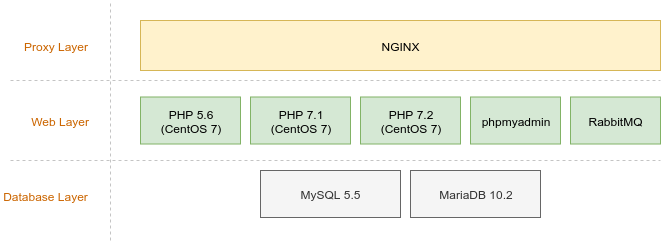

# OrangeHRM Development Environment
    

## Introduction
orangehrm-dev-environment is a dockerized development environment for [OrangeHRM](https://www.orangehrm.com/). This dev environment mainly contains three layers as follows,

- Proxy Layer 
- Web Layer
- Database Layer

Configuration of each layer has been added according to the OrangeHRM requirements.

## Prerequisites
- Docker engine installed.([Get docker](https://docs.docker.com/engine/installation/))
- Minimum docker version 17.3
- Minimum docker-compose version 1.12. ([Get docker compose](https://docs.docker.com/compose/install/))

## Architecture

## How to use ?

The Dev environment has been configured to use **443** port as the default web port. So make sure that the 443 port of your host machine is been used by none of the other services (eg:- apache, tomcat, nginx, etc). 
##### Installation

1. Download the zip
2. Extract the zip anywhere you want
3. run the command `php start.php`
4. Select the environment type you want (Use **ARROW_KEYS** to change the selection, and press **ENTER** to continue)
   - **Basic environment** - PHP 5.6, PHP 7.1, PHP 7.2, nginx, phpmyadmin, RabbitMQ, MySQL 5.5 and MariaDB 10.2 containers.
   - **Custom environment** - You can select available custom container as your requirement

##### Host an instance
After the installation add below URLs to your /etc/hosts file.
- phpmyadmin.orangehrmdev.com
- rabbitmq.orangehrmdev.com

###### Enterprise Hosting
- Document Root: /var/www/html/OHRMStandalone/TEST
- Naming Conventions
  - web56: **NAME**-test-web56.orangehrmdev.com
  - web71: **NAME**-test-web71.orangehrmdev.com
  - web72: **NAME**-test-web72.orangehrmdev.com
  
###### Opensource Hosting
- Document Root: /var/www/html/OHRMStandalone/OPENSOURCE
- Naming Conventions
  - web56: **NAME**-os-web56.orangehrmdev.com
  - web71: **NAME**-os-web71.orangehrmdev.com
  - web72: **NAME**-os-web72.orangehrmdev.com

Replace the **NAME** with any name you want for your instance.

## Containers

| Container Name | Service Name in docker-compose.yml | Description | IP Address | Ports (Inside the Container) | Ports (Host Machine)|
|----------------|------------------------------------|-------------|------------|------------|---------------------|
| nginx          | web56                              | PHP 5.6     | 10.5.2.1   | 443        | 443
| dev_web_56     | web56                              | PHP 5.6     | 10.5.0.56  | 443        | - |
| dev_web_71     | web71                              | PHP 7.1     | 10.5.0.71  | 443        | - |
| dev_web_72     | web72                              | PHP 7.2     | 10.5.0.72  | 443        | - |
| dev_mysql_55   | db55                               | MySQL 5.5   | 10.5.1.55  | 3306       | - |
| dev_mariadb_102| db102                              | MariaDB 10.2| 10.5.1.102 | 3306       | - |
| dev_phpmyadmin | phpmyadmin                         | phpMyAdmin  | 10.5.2.2   | 80         | - |
| dev_rabbitmq   | rabbitmq                           | RabbitMQ 3.6| 10.5.2.3   | 15671,5671 | 15671 |

## How to use custom containers?
- Compose files for custom containers have been located under ./custom-compose directory. Run `php env-start.php` and select the "Custom Environment" option. Then select the containers you need as you wish (Use **ARROW_KEYS** to move up and down and press **SPACE** to do the selection. And press **ENTER** to continue.).
 
- Available custom containers
   - db56 - MySQL 5.6
   - db57 - MySQL 5.7
   - ldap - openldap and phpldapadmin
   - mariadb103 - MariaDB 10.3
   - mongodb - mongo DB Database
   - oracle11 - Oracle 11 Database
   - ubuntuweb71 - Ubuntu 18.04 PHP 7.1 container
   - web 70 - CentOS 7 PHP 7.0 container
   - xhgui - XhGUI profiling tool
  
- Moving from custom version to basic version -  `docker-compose up -d --remove-orphans`
